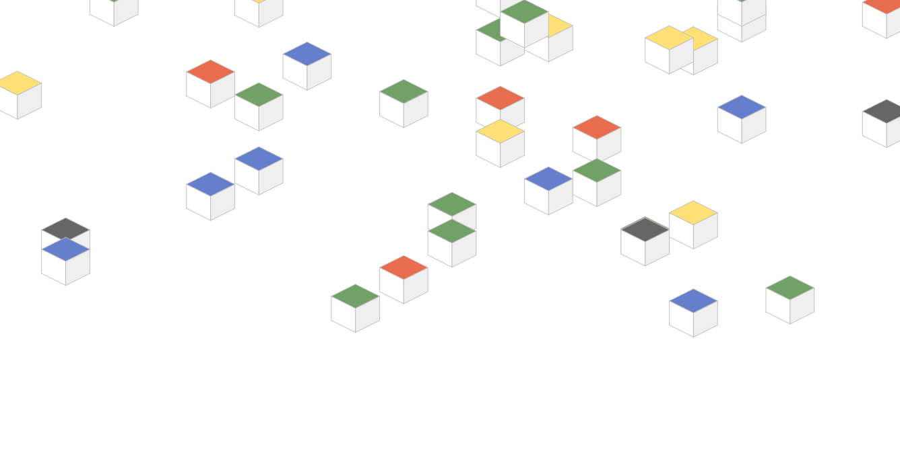

# admataz react.js scroll boxes and webpack boilerplate

This is an extraction of a little experimental [react.js-driven](https://facebook.github.io) animation effect I've had running as a [background on my website](http://admataz.com) for some time. 

This has been a code exercise in modularisation with latest React, and has been a valuable test case for setting up a simple boilerplate for [webpack](https://webpack.js.org/) - which has become it's main purpose for me. 

### License
License: [MIT 2017 Adam Davis](./license.txt)